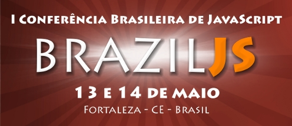

Nos dias 13 e 14 de maio aconteceu a primeira conferência com foco em JavaScript do Brasil, batizada de **BrazilJS**. Esse evento veio para mostrar como o interesse por JavaScript (JS) cresceu exponencialmente nos últimos anos. Antes o coitado do JS, era visto apenas como uma linguagem para validar formulários. Com o passar do tempo, foi crescendo o numero de **frameworks**, técnicas e **design patterns** que faziam o uso da linguagem, isso de certa forma acabou a tornando uma ferramenta mais produtiva e poderosa para criar interfaces ricas, games, e até usa-la no lado servidor.

O evento realizado no teatro da Faculdade Sete de Setembro, em Fortaleza, teve cerca de 550 inscritos, isso mesmo 550! Para um evento fora do eixo Rio-São Paulo, isso foi uma excelente marca. O evento mostrou 20 palestras, com bom conteúdo técnico, apresentando assuntos do nível básico ao avançado em JavaScript. O evento contou com a excelente organização do [@cmilfont][1], [@jaydson][2], [@felipenmoura][3], [@fbarroso][4] e [@henriquegogo][5] e atraiu olhares até de organizadores das conferencias de JS de fora do Brasil, pela sua dimensão.

[1]: http://twitter.com/#!/cmilfont
[2]: http://twitter.com/#!/jaydson
[3]: http://twitter.com/felipenmoura "Felipe Nascimento"
[4]: http://twitter.com/fbarroso "Barroso"
[5]: http://twitter.com/henriquegogo "Henrique Gogo"

Estava com grandes expectativas para palestras do [Guilherme Chapiewski][7], [Léo Balter][8], [Pedro Pimentel][9], [Mike Taylor][10], [Richard Worth][11], [Michal Budzynski ][12]e [Emerson Leite][13]. Tivemos boas apresentações, que mostraram um uso bem bacana do que fazer com a linguagem. Além dos palestrantes citados anteriormente, gostei muito das apresentações do Rafael Ferreira e do [Bruno Fernandes][14], eles mandaram muito bem! Infelizmente perdi as palestras do [Maujor][15], do [David Herman][16] e os Lightning Talks, da hora do almoço.

[7]: http://twitter.com/#!/gchapiewski
[8]: http://twitter.com/#!/leobalter
[9]: http://twitter.com/#!/zukunftsalick
[10]: http://twitter.com/#!/miketaylr
[11]: http://twitter.com/#!/rworth
[12]: http://twitter.com/#!/michalbe
[13]: http://codificando.com/
[14]: http://twitter.com/#!/Porkaria
[15]: http://twitter.com/#!/maujor
[16]: http://twitter.com/#!/LittleCalculist

[Bruno Porkaria][17] mostrou para galera como investir em WebApps, tivemos também o Daniel Passos que veio mostrar que utilizar JavaScript no desenvolvimento para aplicativos de Android. O Douglas Campos mostrando um pouco do poder da JVM com Javascript. [Leo Balter][18] fez uma apresentação que consistia em mostrar anti-padrões de JS. Mike Taylor falou sobre **Web Messaging**. Guilherme Chapiewski sobre Titanium e YQL, **[Michal Budzynski][12]** falou sobre desenvolvimento de Jogos em JavaScript.

[17]: http://twitter.com/#!/porkaria
[18]: http://leobalter.net/

Além disso o **BrazilJS** foi uma excelente oportunidade para conhecer pessoas que eu antes só as conhecia por listas de discussão/twitter/facebook. Conheci e revi uma parte da galera do **frontend-br**, e até fizemos nosso 1º encontro da lista FORA da Recife. A ocasião contou com a presença de [Luiz Tiago Oliveira][19], [Dennis Callazans][20], [Gerson Thiago][21], [Djalma Araújo][22], Bruna Brito, [Felipe Rodrigues][23], [Bruno Souza][24], Lucas, Eduardo Santos e o Hedcler Morais. O papo NERD e _frontendilistico_ rolou até aproximadamente 1h da madrugada.

[19]: http://twitter.com/#!/luiztiago
[20]: http://twitter.com/#!/dannnish
[21]: http://twitter.com/#!/gersonthiago
[22]: http://twitter.com/#!/djalmaaraujo
[23]: http://twitter.com/#!/feliperodrigues
[24]: http://twitter.com/#!/brunosouza

##Pronunciamento do @maujor

Encerrando o evento. tivemos esse pronunciamento do @maujor… Sinceramente o evento superou todas as minhas expectativas.

Voltando para o Rio, ainda troquei uma ideia com o [David Herman][26] e Mike Taylor no Aeroporto de fortaleza, como o Mike iria para São Paulo, acabou ficando pouco tempo na conversa. Após o embarque do Mike, fiquei conversando com Herman, logo após chegou o Alexandre Magno e, nós 3, trocamos uma ideia sobre JSConfs, BrazilJS, Mozilla, Firefox, Brasil e Califórnia. Uma boa oportunidade para praticar meu fraco inglês (sic), também. E ainda nosso voo para o Rio de Janeiro acabou atrasando cerca de 2 horas.

[26]: http://twitter.com/#!/littlecalculist

Para quem tá por ai no nordeste é bom ficar ligado no [ENSOL 2011][27], em João Pessoa. Fui ano passado e também foi um evento muito bom.

[27]: http://www.ensol.org.br/
