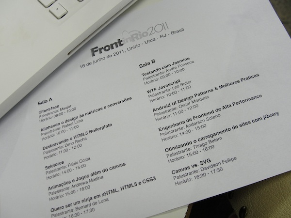
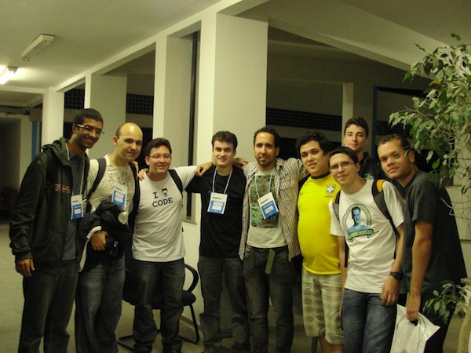

No último sábado, 18, conforme [já citado por esse blog][2], aconteceu o FrontInRio 2011. Esse evento foi o primeiro com foco em desenvolvimento client-side em terras fluminenses. O evento que reuniu cerca de 170 inscritos, aconteceu na UniRio, no bairro da Urca e contou com 12 palestras de grandes nomes do cenário local. As palestras foram divididas em duas salas, cobrindo assuntos de nível básico ao avançando.

[2]: http://fellipe.com/blog/front-in-rio-2011/

O evento começou com as apresentações de **Maujor** e **André Fonseca**. A palestra do primeiro apresentou o tema @font-face e a do segundo foi sobre Testes unitários com javascript, usando o Jasmine.

Em certos momentos ficou difícil de escolher em qual sala ficar,
além desse fato, tiveram palestras que não assistir devido a grande lotação da sala, como foi o caso da palestra sobre WTF
JavaScript com [Leo Balter][3]. As palestras que assisti foram:
Desbravando o HTML5 Boilerplate com [Zeno Rocha][4], Android UI Design Patterns & melhores Práticas com Oscar Marques, Seletores com Fábio Costa, Animações e Jogos além do canvas com Andrews Medina.

[3]: http://leobalter.net/
[4]: http://zenorocha.com/

## Android UI Design Patterns & melhores Práticas com Oscar Marques

Oscar apresentou boas praticas sobre desenvolvimento com Android, trazendo várias formas de como utilizar elementos gráficos do sistema operacional Android.

## Desbravando o HTML5 Boilerplate com Zeno Rocha

Zeno apresentou conceitos sobre técnicas do html5, apresentando um hands on para mostrar a estrutura do html5. Falou sobre o build script, uma ferramenta bacana
para compressão de arquivos. Apresentou também o Mobile boilerplate. Além da utilização do boilerplate com wordpress, rails, drupal e django.

## Seletores com Fábio Costa

Fábio várias formas de otimização de seletores, com uma palestra que interagiu bastante com o público presente. Foi uma palestra com um bom nível técnico, apresentando abordagens de seleção top-down e bottom-up, além é claro de boas praticas de otimização. Falando ainda sobre as engines Slick (usado pelo mootools) e a Sizzle (usado pelo JQuery).

## Animações e Jogos além do canvas com Andrews Medina

Andrews Medina trouxe vários pontos legais sobre como usar CSS transforms, transitions, animations para o desenvolvimento de jogos usando as CSS3, além de fazer um comparativo com o desenvolvimento de jogos usando Canvas. Os códigos de sua palestra podem ser conferidos no [GitHub dele][5].

[5]: https://github.com/andrewsmedina/pacman

## Canvas vs SVG, comigo

Apos minha palestra no BrazilJS, percebi que poderia fazer uma específica sobre um dos slides da mesma. Sendo assim apos o convite do Leo Balter,
para eu apresentar uma palestra no FrontInRio, escolhi esse tema. Comecei apresentando sobre alguns conceitos que seriam relevantes para o entendimento,
mostrei também as principais diferenças entre as duas técnicas, o suporte aos browsers, libraries tanto para SVG quanto para Canvas, um hands on cujo código pode ser encontrado em [meu repositório no GitHub para palestras][6].

<iframe src="https://www.slideshare.net/slideshow/embed_code/key/cBrSaB767SSlID" width="595" height="485" frameborder="0" marginwidth="0" marginheight="0" scrolling="no" style="border:1px solid #CCC; border-width:1px; margin-bottom:5px; max-width: 100%;" allowfullscreen> </iframe>

 <strong> <a href="//www.slideshare.net/davidsonfellipe/canvas-vs-svg" title="CANVAS vs SVG @ FrontInRio 2011" target="_blank">CANVAS vs SVG @ FrontInRio 2011</a> </strong> from <strong><a href="//www.slideshare.net/davidsonfellipe" target="_blank">Davidson Fellipe</a></strong> 

## Agradecimentos

-   Organizadores do evento, que estão de parabéns pela realização
-   Leo Balter, pelo convite
-   Globo.com, patrocinadora do evento
-   Todos presentes no evento, sem vocês o evento não teria sido um sucesso!

[6]: https://github.com/davidsonfellipe/talks/tree/master/2011_frontinrio
