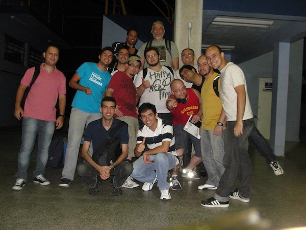

No dia 21 de janeiro, Belo Horizonte foi palco de um evento bem legal sobre Javascript, o mesmo reuniu a comunidade mineira e grandes nomes da área, tais como Luciano Ramalho, Diego Fleury, Zeno Rocha, Irae, Eder Frances, Suissa, Milfont, Marcos Souza e Herberth Amaral, também palestrei por lá.

Tomei conhecimento sobre o evento em 22 de Dezembro, logo quando comecei a trocar umas ideias com o organizador (@eder_frances), e falei um pouco sobre o riojs, ele acabou curtindo a ideia e criando também o [BeagaJS no facebook][2], que hoje já conta com 108 membros, é notavel a influencia do evento no rápido crescimento do grupo.

[2]: http://www.facebook.com/groups/beagajs/

O evento teve a abertura com o Diego Fleury que apresentou os cases: Ego e Paparazzo, mostrando soluções para diversos problemas enfrentados. Logo apos, tivemos o Eder Frances apresentando sobre ExtJS, e fechando a manhã, o curitibano Zeno Rocha. Posteriormente, partimos para o almoço, onde rolou um belo papo, com os presentes na foto abaixo.

Voltando do almoço, acabei perdendo a palestra do Iraê, mas ainda tinhamos, uma longa tarde de palestras, sendo 6, no total. Começando pela apresentação do Milfont, que fez todos de levantarem, obviamente para despertar aqueles que gostam de uma soneca pós-almoço. Logo após, tivemos as apresentações do Herberth Amaral e a do Marcos Souza. Como penultima apresentação, tivemos a minha palestra sobre [Performance em jQuery Apps][4]. Fechando o evento com chave de ouro, tivemos o Luciano Ramalho ([@luciano][5]), passando um pouco de sua larga experiencia, para nós iniciantes na área de desenvolvimento.

[4]: http://www.slideshare.net/davidsonfellipe/jqueryperf
[5]: https://twitter.com/#!/luciano

Seguem links para algumas palestras do evento:

1. [Como usar HTML5 sem uma máquina do tempo][7] – Zeno Rocha
2. [Performance em jQuery Apps][4] – Davidson Fellipe
3. [Combinando OO e funcional numa abordagem prática][8] – Cristiano Milfont
4. [Backbone e Knockout: comparativo entre frameworks MVC e MVVM][9] - Herbert Amaral
5. [Dicas para criar plugins e widgets com jQuery ][10]- Marcos Sousa
6. [Automatizando testes de JavaScript no frontend][11] – Iraê Lambert
7. [JS Storage][12] – Jean Nascimento (Suissa)
8. [Ego & Paparazzo][13] – Diego Fleury

[7]: http://comousarhtml5semumamaquinadotempo.com/#1
[8]: http://www.slideshare.net/cmilfont/beagajs
[9]: https://github.com/herberthamaral/bhjs
[10]: http://www.slideshare.net/marcossousa/indo-alem-jquery3
[11]: http://irae.github.com/frontend-tests-pt/#slide1
[12]: http://frontendbrasil.com.br/suissa/eventos/beagajs/#/
[13]: http://www.slideshare.net/dfleury/ego-e-paparazzo

BeagaJS 2013?

O evento tem tudo para ganhar uma nova edição, para fortalecer ainda mais a comunidade frontend mineira.
