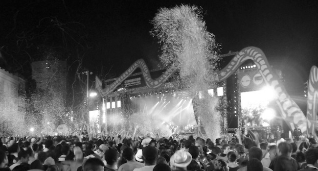
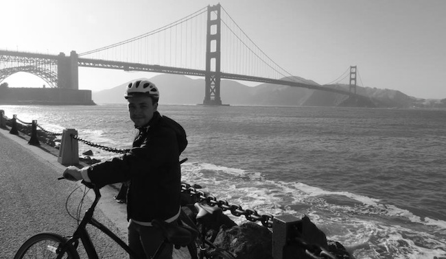
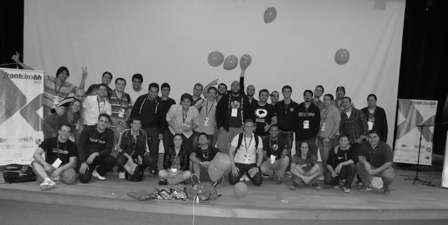
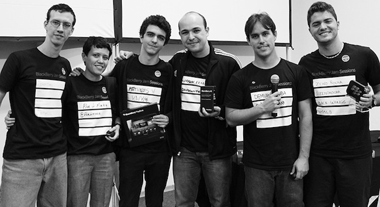
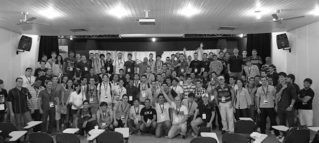
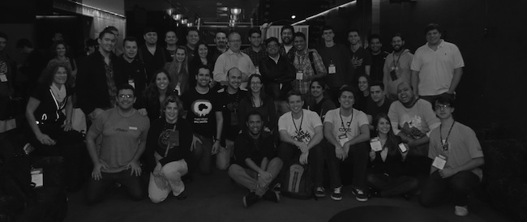

Depois de ler alguns depoimentos de alguns amigos sobre 2012, resolvi escrever o meu. Esse ano, foi o ano que fez mais diferença na minha carreira profissional, e que ano! Comecei o ano visitando pela primeira vez a capital mineira, onde tive o prazer de palestrar no [BeagaJS][1], onde abordei o tema de [Performance em jQuery Apps][2]. Depois tirei férias… o/

[1]: http://fellipe.com/blog/relato-sobre-o-beagajs/
[2]: http://www.slideshare.net/davidsonfellipe/jqueryperf

Nessas minhas primeiras férias, depois de 5 anos de faculdade e 1 ano e meio de Globo.com, resolvi conhecer o 2º destino turistíco mais visitado desse país, e o que eu tinha mais interesse em conhecer: A bela Foz do Iguaçu, e ainda visitei, a simpática Puerto Iguazú (Argentina) e a bagunçada Ciudad del Este (Paraguai), essa região de fronteiras é incrível e com muitas culturas diferentes, que se eu fosse contar todos os detalhes mereceria um post exclusivo.

## De volta a terrinha & Carnaval…

Depois de uns 6 meses sem voltar a Recife, fui rever minha cidade, e curtir o melhor formato de carnaval desse país, onde até pessoas com não dão valor ao samba, conseguem se divertir. #troll

Nada melhor que essa ultra-mega-hiper lotada Praça do Marco Zero, ao som de Seu Jorge e Nação Zumbi, tocando até o amanhecer para matar saudades de Recife.

## Contribuindo para o crescimento do frontend em Pernambuco

Após voltar para o mundo real, tinha que começar a pensar no que eu poderia fazer de diferente em 2012, algo que pudesse ajudar a vida de muitas pessoas, então resolvi participar da organização de um evento para minha *terrinha* com grandes nomes da área do Javascript, [junto com Luiz Tiago e Thiago Azurém criamos o PernambucoJS][5], com a grande colaboração de Djalma Araújo e Eduardo Lundgren.

[5]: http://fellipe.com/blog/pernambucojs-2012-pre-evento/

O [PernambucoJS][6] foi um projeto de cerca de 3 meses, onde levamos 7 palestrantes e contou com a presença de cerca de 220 pessoas. E ainda palestrei sobre[ JavaScript Cross-Browser][7].

[6]: http://www.pernambucojs.com
[7]: http://www.slideshare.net/davidsonfellipe/javascript-cross-browser " Javascript Cross-browser"

## Mestrado na PUC-Rio

Ainda em março, comecei o Mestrado na PUC-Rio, talvez essa tenha sido uma decisão não tão legal para esse ano, mas por não ter conseguido me candidatar em 2011 (ano que seria mais indicado) resolvi encarar o desafio, mesmo assim vem sendo complicado achar disciplinas que eu ache relevante para minha carreira. :/

## Viagem aos EUA

Em Maio, fiquei na expectativa de minha primeira viagem internacional segunda viagem internacional, se considerarmos uma visita a Argentina e Paraguai em Janeiro.

Depois da correria para visto e passaporte, embarquei com destino a San Francisco para participar da [Fluent Conferenc][10]e, a primeira conferência focada em JavaScript da O’Reilly, realizada na apaixonante San Francisco. Foram 3 dias de evento, e uma ótima oportunidade para troca ideias com desenvolvedores de várias partes do mundo, e abrir meus olhos para o grande crescimento do mercado de mobile para o desenvolvedor Frontend. Mais detalhes sobre o que rolou no evento podem ser conferidos nessa minha apresentação: [Fluent Conference Highlights][11], que apresentei em um TechTalk lá na Globo.com e também no Rio.js. Ainda pude conferir uma SF em clima de festa, em comemoração dos 75 anos da [Golden Gate Bridge][12], que trouxe um tempero especial para essa viagem.

[10]: http://fluentconf.com
[11]: http://fellipe.com/slides/fluent2012/pt
[12]: http://www.youtube.com/watch?v=KPsXd28iuPc

## Preparativos para o Front in BH

 Esse ano fui convidado pelo Giovanni Keppelen, para participar da organização da 2ª edição do Front in BH, evento realizado em julho, que contou com cerca de 320 participantes na capital mineira, era apenas minha 2ª vez na cidade, e foi bastante gratificante os ótimos feedbacks que recebemos dos belo-horizontinos. Para mais detalhes técnicos sobre o que rolou no evento, confira esse post do Sérgio Lopes:

-   [Front In BH 2012: anotações da palestra ‘WordPress aliado do Front End’ do Leandro Vieira][15]
-   [Front In BH 2012: anotações da palestra ‘REST client side’ do Alexandre Gaigalas][16]
-   [Front In BH 2012: anotações da palestra ‘Amazon EC2 e CDN no Peixe Urbano’ do Alexandre Tabor][17]
-   [Front In BH 2012: anotações da palestra ‘Novo Cinto de Utilidades do Desenvolvedor JavaScript’ do Leo Balter][18]
-   [Front In BH 2012: anotações da palestra ‘Estilizando Folhas de Estilo com Estilo’ do Bernard De Luna][19]
-   [Front In BH 2012: anotações da palestra ‘Desafios do Design Mobile’ do Horácio Soares][20]
-   [Front In BH 2012: anotações da palestra ‘CSS sucks’ do Zeno Rocha][21]
-   [Front In BH 2012: palestra sobre performance e otimizações web][22]

[15]: http://sergiolopes.org/front-in-bh-wordpress-leandro-vieira/
[16]: http://sergiolopes.org/front-in-bh-rest-client-side-alexandre-gaigalas/
[17]: http://sergiolopes.org/front-in-bh-peixe-urbano-amazon-cdn-alexandre-tabor/
[18]: http://sergiolopes.org/front-in-bh-novidades-mozilla-leo-balter/
[19]: http://sergiolopes.org/front-in-bh-estilizando-css-com-estilo-bernard-de-luna/
[20]: http://sergiolopes.org/front-in-bh-desafios-design-mobile-horacio-soares/
[21]: http://sergiolopes.org/front-in-bh-css-sucks-zeno-rocha/
[22]: http://sergiolopes.org/frontinbh-otimizacoes-web/

## IV FSLDC – Duque de Caxias, RJ

No final de junho rolou mais uma edição do Fórum de Software Livre de Duque de Caxias – FSLDC 2012. O evento que contou com cerca de 340 pessoas, e nessa minha primeira apresentação nesse fórum, mostrei minha palestra sobre [Performance em jQuery Apps][2].

## PHP n’ Rio 2012

Em novembro rolou o PHP n’ Rio, evento carioca organizado por membros da comunidade local de PHP. Evento que é realizado desde 2009, com um público sempre crescente. Antes do evento participei desse hangout com o Vínicius Machado ( membro da organização ):

## Hackathon da BlackBerry Jam Sessions

Em setembro tive a oportunidade de participar do muito bem organizado BlackBerry Jam Sessions #5, realizado no Rio de Janeiro, foi minha primeira participação em um Hackathon, onde fiz um grupo junto com Matheus Vilaça, Flor di Maria, Zeno Rocha, Zanoni Miranda, apenas o Zeno, eu já conhecia antes do evento, e após 10 horas de programação, apresentamos o jogo [Black Wings][25], e vencemos na categoria Melhor Jogo. Todo jogo está [disponível no GitHub][26]. Para maiores informações sobre o evento acesse esse [link][27].

[25]: http://html5-pro.com/black-wings/
[26]: https://github.com/html5-pro/black-wings
[27]: http://blackberryjamsessions.com/2012/09/22/rio-de-janeiro-brazil/

## Primeiro artigo na Revista Wide

Em julho deste ano, eu fui convidado pela Revista Wide para participar da matéria intitulada:

_Frontend – Made in Brasil: Há dois anos as empresas brasileiras não demonstravam muito interesse por esse profissional, enquanto já existia uma forte demanda no exterior. Isso mudou?_

Esse foi outro grande desafio para esse ano, onde busquei expor minha visão atual sobre a área de desenvolvimento frontend, e mostrando aos interessados na área, o que o mercado exige de nós profissionais. Obrigado Arteccom pela oportunidade.

## Front in Maceió

 Em outubro estava de volta ao nordeste, e dessa vez para um estado bem representativo em minha vida, e onde vive grande parte de minha família. Apesar das dificuldades, fizemos um evento de TI para 200 pessoas nessa capital com menor IDH do Brasil, esse foi um fato que trouxe uma grande satisfação, mas não foi fácil conseguir apoio para o evento. Por outro lado, Juarez P.A. Filho e eu, tivemos que pensar em várias estratégias de marketing para tornar possível essa ideia. Conheci muitos devs de lá, e estou gostando de ver esse Buzz pós-evento gerado na região, a [turma do Caravana Web][30] está quebrando tudo por lá.

[30]: https://www.facebook.com/groups/caravanaweb/?fref=ts

## BrazilJS Foundation & BrazilJS Conference

 Em Julho, anunciamos a [Fundação BrazilJS][33], que é uma fundação sem fins lucrativos com a missão de mover e unir a comunidade de JavaScript no Brasil. Onde sou mais ligado a apoios a eventos regionais e a [BrazilJS Weekly][34].

[32]: /assets/img/braziljs.jpg
[33]: http://braziljs.org/
[34]: https://github.com/braziljs/weekly

Já em agosto, rolou a BrazilJS Conference, um evento que superou todas minhas expectativas, e pela primeira vez reuniu a grande maioria da comunidade frontend do país, e grandes palestrantes do Brasil e do mundo, que também contou com forte apoio da [Globo.com][35], onde levamos um belo stand. Sem dúvida esse foi o momento “mais friozinho na barriga” do ano, subir num palco quase 1 mil pessoas presentes num teatro em Porto Alegre, não foi fácil e ao mesmo tempo foi o maior desafio para a timidez na minha vida! Fiz a primeira palestra do segundo dia do evento, com o tema [Performance em JavaScript][36].

[35]: http://opensource.globo.com/
[36]: http://fellipe.com/slides/performance-javascript/#1

Após ser anunciado e subir alguns degraus, vi aquela enorme platéia, bebi um gole de água, e falei para mim: “Vai lá e faz a melhor apresentação que você já fez na vida”, após uns 5 minutos tentando me entender com a forte iluminação, acredito que consegui passar a ideia para maioria dos presentes, e coletei feedbacks da apresentação, que já pude mostrá-los em um Workshop na Globo.com.

## Por último, mas não menos importante…

Considerando atividades que me envolvi o ano todo, posso destacar: O trabalho no [Futpédia][37], em melhorias de frontend e no lançamento da [página de equipe][38], foi meu primeiro envolvimento em um projeto Ruby on Rails, e gostei bastante de trabalhar com esse framework e com Rspec. Além disso, no final do ano lançamos o [Eu Atleta][39], primeiro projeto que usei HTML5 na área de esportes da Globo.com, e pude brincar com Twitter Bootstrap, History API, Geolocation, grande preocupação em navegação com e sem javascript. Uma das páginas que mais gostei de trabalhar foi a de [calendário de eventos][40].

[37]: http://futpedia.globo.com
[38]: http://futpedia.globo.com/brasil
[39]: http://globoesporte.globo.com/eu-atleta
[40]: http://globoesporte.globo.com/eu-atleta/calendario.html

## E 2013?

-   Beber mais água e evitar outro calculo renal
-   Voltar a praticar exercícios e emagrecer 11kg
-   Terminar as disciplinas do Mestrado
-   Correr uma corrida de rua
-   Ir a outro evento internacional (QConSF, QConNY, JSconf Arg ou JSconf EUA)
-   Aumentar a visibilidade da BrazilJS Foundation
-   Um Front in BH épico
-   Um Front in Maceió épico
-   Um PernambucoJS épico
-   Novo layout do blog

## Agradecimentos

A minha esposa, que mesmo não tendo nada a ver com desenvolvimento, se envolveu bastante nos eventos. A Globo.com pelo incentivo a participar nos eventos e mestrado, ao [BrazilJS Team][41], a galera que participou do RioJS, PernambucoJS, Front in Maceió e Front in BH, aos parceiros de organização [Giovanni Keppelen][42] (RioJS e Front in BH), Victor Ferraz (BH), Juarez (Maceió), Luiz Tiago (PernambucoJS) e Azurém (PernambucoJS).

[41]: http://braziljs.org/team/
[42]: https://twitter.com/Keppelen
