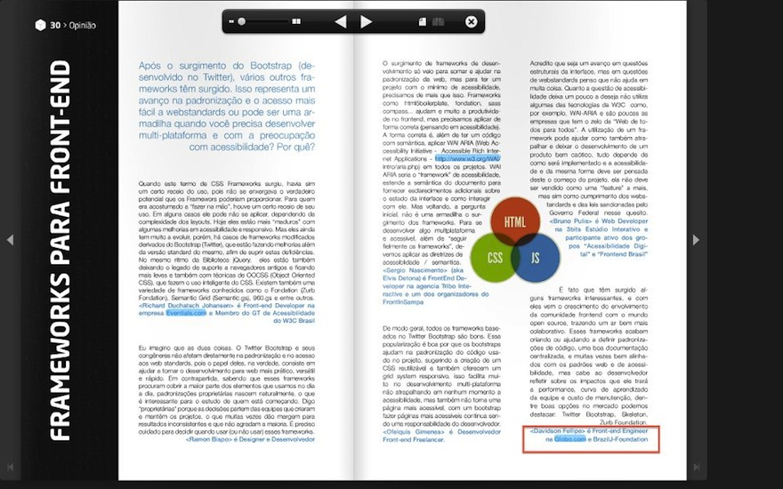

## Originally published in [edition No. 5][1], iMasters Magazine, Year 2, on March 2013.

In this fifth edition's [iMasters Magazine][0], magazine's major brazilian portal about web development, I wrote an opinion about Frameworks for frontend Development.

[0]: http://issuu.com/imasters

> " It's a fact that has emerged some interesting about frameworks for front end development, and also, comes the growth of
> frontend community involvement with the open source world, bringing an ecosystem much more collaborative. These Frameworks end
> up creating or helping to set standardizations code, with a good documentation centralized, and often, supporting web standards
> and good accessibility, but the developers must be think about impacts that he will bring the performance, learning curve for
> team and maintenance cost among the options market can highlight: Twitter Bootstrap, Skeleton, ZURB Foundation."

To read this complete article, visit the magazine (free online version):
[http://issuu.com/imasters][1]

[1]: http://issuu.com/imasters
