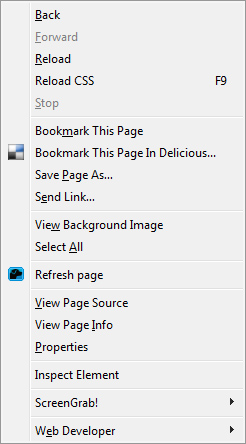

Um tempo atras, eu encontrei essa extensão do **Firefox**, conhecida como **CSS Reloader**. Ela permite **recarregar** o TODOS os arquivos de **CSS** incorporados a página sem fazer recarregar a mesma. Uma boa **ferramenta** para quem trabalha com páginas que possuem um tempo de carregamento um pouco mais demorados. Tornando seu desenvolvimento de **CSS** mais **produtivo**.

Você pode usa-lo pressionando a tecla F9, ou a opção do menu de contexto do “Reload CSS” para recarregar os seus arquivos de CSS na página.

Para detalhes de seu uso basta acessar: 
<a href="https://addons.mozilla.org/de/firefox/addon/46211/">https://addons.mozilla.org/de/firefox/addon/46211/</a>

Para o Chrome: 
<a href="https://chrome.google.com/extensions/detail/dnfpcpfijpdhabaoieccoclghgplmpbd">https://chrome.google.com/extensions/detail/dnfpcpfijpdhabaoieccoclghgplmpbd</a>

No github: 
<a href="https://github.com/auchenberg/css-reloader" target="_blank">https://github.com/auchenberg/css-reloader</a>

