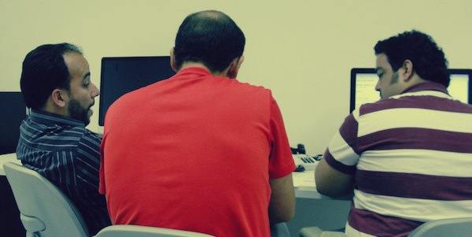

Começar a escrever um resumo antes da realização do evento, como assim?

É… Eu quis inverter essa ordem, pois para mim ele já começou há uns 2 meses.

Vamos lá. O [PernambucoJS][1] 2012 nasceu apos várias conversas com o Luiz Tiago ([@luiztiago][2]) sobre a necessidade de realizarmos um [encontro do grupo pernambucoJS][3], já existente no _facebook_, nos unimos ao Thiago Azurem ([@azurem][4]) e elaboramos um pré-projeto do evento. A foto abaixo foi de nossa primeira reunião presencial para finalização do documento do projeto.

[1]: http://pernambucojs.com
[2]: http://twitter.com/luiztiago
[3]: http://www.facebook.com/groups/pernambucojs/
[4]: http://twitter.com/azurem

Não foi nada fácil para nós conseguirmos um auditório para realização do evento, diante da verba inicial que tínhamos para o projeto R\$ 0. Mas a vontade de realizar algo PHoda para nossa cidade era maior, e fomos atrás. Conseguimos inicialmente o auditório na **[Faculdade Mauricio de Nassau][6]**, que gentilmente aceitou apoiar o evento, sem esse espaço dificilmente conseguiríamos andar com o projeto.

[6]: http://www.mauriciodenassau.edu.br/

Diante de nossas limitações de tempo, pelo fato de cada um dos 3 ter suas obrigações profissionais, estava bem difícil para criarmos um site e uma identidade visual maneira para o evento, nesse quesito entrou a **[PianoLab][7]** para nos ajudar e nos presentou com um belo site, demonstrando um total apoio ao evento.

[7]: http://www.pianolab.com.br

A partir dai tivemos um grande desafio: Como elaborar um bela grade de palestras, trazendo grandes nomes do desenvolvimento Javascript no Brasil?

Não pensamos pequeno nesse quesito, pois queríamos trazer bons nomes, e que movimentaram o javascript no Brasil, nos últimos tempos. Vamos aos nomes (em ordem alfabética):

##Bernardo Heynemann

Atualmente ele é líder técnico da home da Globo.com. Possui uma grande experiência em desenvolvimento de software, passando por empresas do Brasil e Reino Unido. É um grande contribuidor dos projetos Pyccuracy, Skink, Ion, Thumbor e pyVows. Responsável direto pela implementação do responsive design na [home do etc][8].

[8]: http://etc.globo.com

##Eduardo Lundgren

Ex-contribuidor dos projetos jQuery e jQuery UI, e hoje um dos principais nos do YUI no Brasil. Além de ser um dos criadores do AlloyUI. Dai já ficamos com aquela pergunta na cabeça, porque ele deixou o jQuery e migrou para o YUI? Acredito que será uma das respostas mais aguardadas do evento. Além de ter sido um dos palestrantes na yuiconf 2011, em Santa Clara, Califórnia. Atualmente é líder de desenvolvimento da Liferay, e divide seu tempo entre Recife e Califórnia.

##Jaydson Gomes

Um dos criadores do BrazilJS, maior conferencia de javascript do Brasil e fundador do grupo de desenvolvedores javascript do Rio Grande do Sul, o RSJS. Atualmente é Desenvolvedor Sênior no Terra Networks.

##Jean Nascimento

Evangelista de nosql no brasil e grande colaborador do nosqlbr.com.br, javascriptbrasil.com, frontendbrasil.com.br e jquerybrasil.org, além de ser organizador do Sampa.js. Além disso tudo, tem tempo para trabalhar como programador PHP Sênior na GoNow.

##Luiz Tiago

Individuo pré-histórico do frontend-br, grupo que começou há muito tempo atras em Recife, acredito que 2006. Foi vencedor do prêmio Peixe Grande de 2007, promovido pela Arteccom. Co-fundador do jQueryBrasil e PernambucoJS. Atualmente é Gerente de Frontend da MGR Tecnologia.

##Zeno Rocha

Quase tivemos que pedir autorização dos pais dele para ele vir ao evento… Ele é um dos criadores do jQuery Boilerplate e do Wormz do Chrome Experiments. Já foi desenvolvedor de software na Petrobras e hoje trabalha no Globoesporte.com. Sobre a autorização é brincadeira, pois ele já tem 21 anos e faz de Sistemas de Informação na Universidade Federal do Estado do Rio de Janeiro.

##Bruno Souza, Dennis Calazans e Djalma Araújo

Três caras que representam bem o desenvolvedores frontend de Recife, o primeiro também é da pré-história do frontend em pernambuco e hoje é um dos lideres de desenvolvimento da Ogilvy Recife. O segundo foi um dos primeiros instrutores de cursos de javascript no Recife e hoje é professor da Unibratec e Faculdade Marista. E para finalizar os _lightning talks_ teremos a presença do Djalma Araújo, lider de desenvolvimento da PianoLab e colunista do JqueryBrasil falará um pouco de sua experiencia com o _Bootstrap_.

Foi de fundamental importancia para criação dessa grade de palestras, o patrocinio das empresas: [Liferay][9], [Globo.com][10], [EIA Cursos][11], [MV Sistemas][12], [Terra Networks][13] e [Servhost][14]. Apoiar iniciativas, como o PernambucoJS, são de fundamental importancia para conseguir futuros profissionais e clientes. Hoje é bem complicado para as empresas contrarem desenvolvedores frontend com forte *skill* em javascript.

[9]: http://www.liferay.com/
[10]: http://www.globo.com/
[11]: http://curso.eia.com.br/javascript.php
[12]: http://www.mv.com.br/mv/
[13]: http://www.terra.com.br/portal/
[14]: http://servhost.com.br/novo/

Lançadas as inscrições, nem esperávamos que elas iriam se esgotar em tão pouco tempo, foram 100 inscrições vendidas em apenas 6 dias! Para o primeiro evento foi sensacional. E agradecemos muito, aos inscritos no eventos e aos não-inscritos também. Pois devido aos vários pedidos de inscrições que recebemos, e ao grande numero de pessoas presentes numa lista de espera criada por nós, resolvemos alugar um espaço maior e disponibilizamos mais 80 vagas, que novamente estão praticamente esgotadas! Fiquem ligados o novo local evento, será no [Park Hotel][15], próximo a pracinha de Boa Viagem, no Recife.

[15]: http://www.park.com.br/

Tivemos grandes nomes que fizeram menções ao evento:

**Pinceladas da web**

[https://twitter.com/#!/pinceladasdaweb/status/181791040544583681](https://twitter.com/#!/pinceladasdaweb/status/181791040544583681)

**Maujor**

[https://twitter.com/#!/maujor/status/179722008051990528](https://twitter.com/#!/maujor/status/179722008051990528)

**YUI Team**

[https://twitter.com/#!/yuilibrary/status/181807730015735808](https://twitter.com/#!/yuilibrary/status/181807730015735808)
[http://www.yuiblog.com/blog/2012/04/03/yui-talk-at-pernambuco-js-by-eduardo-lundgren-of-alloyui/](http://www.yuiblog.com/blog/2012/04/03/yui-talk-at-pernambuco-js-by-eduardo-lundgren-of-alloyui/)

**Richard Worth, Líder do jQueryUI**

[https://twitter.com/#!/rworth/status/180759693227073536](https://twitter.com/#!/rworth/status/180759693227073536)

Há inscritos no evento vindo de várias cidades do Brasil, tais como Brasilia, Rio de Janeiro, João Pessoa e até uma caravana saindo de Maceió, organizada pelo [@juarezpaf][16]. É isso… Até lá!

[16]: https://twitter.com/#!/juarezpaf
